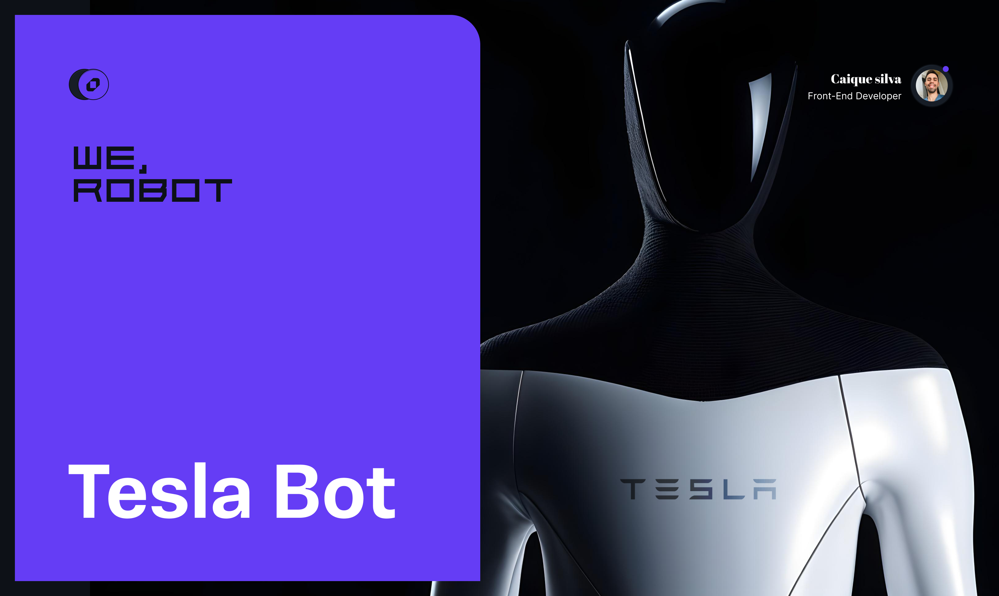

<p align="center">
  
</p>

# PROJETO - TESLA ROBOT 2025

## Descrição
Projeto destinado a colcoar em práticas as habildiades de desenvolvimento web, para fins de estudos e melhoria continua.

## Tecnologias Utilizadas

- HTML5
- CSS3
- Sass
- Javascript
- Gsap Animation
- Versão Mobile (Abordagem feita sem framework).
- Próximas Features (1. Ajustar o Mobile, 2. Implementar um modal.)


Para acessar o projeto ficticio Tesla Robot 2025 - na qual foi desenvolvida a UI Design por Gilberto, o prótotipo de alta fidelidade foi feita para a comunidade para de uma forma mais completa, basta apenas clicar nesse link azul: [Protótipo](https://caiquesilvadev.github.io/tesla-robot/) 

## Instalação
Passos para instalar e configurar o ambiente de desenvolvimento.

```bash
# Baixar o Node.JS 
   - Acesse o site oficial do Node.js: [https://nodejs.org](https://nodejs.org)
   - Baixe a versão LTS (Long Term Support) recomendada para estabilidade.
   - Execute o instalador e siga as instruções de instalação padrão.

# Clone o repositório
git clone https://github.com/seu-usuario/seu-projeto.git

# Navegue até o diretório do projeto
cd seu-projeto

# Instale as extensões
Live sass Compiler
Go live
PX TO REM - Opcional

# Rode o projeto
Watch Sass + Go Live